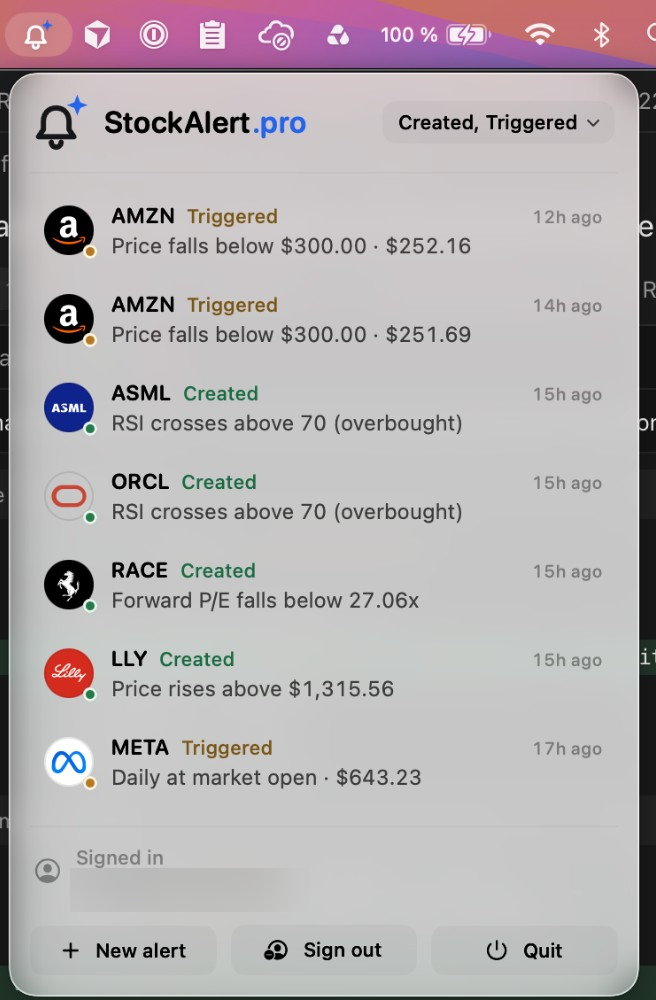
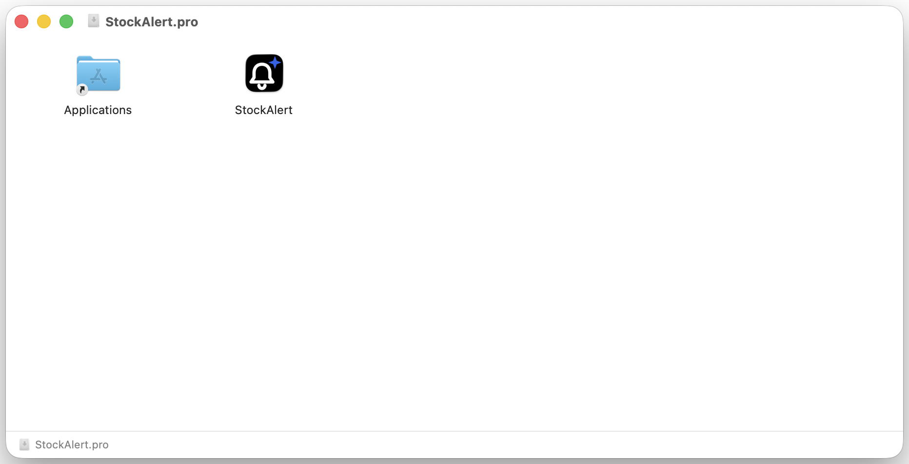

# StockAlert.pro for macOS

Menu bar app for [StockAlert.pro](https://stockalert.pro). Sign in with your dashboard account, watch alert activity, and get a banner when an alert triggers.



## Requirements

- Apple Silicon Mac
- macOS 26 or later

Intel Macs and older macOS versions are not supported.

## Install from the disk image

1. Open the latest [GitHub Release](https://github.com/stockalert-pro/stockalert-osx-menubar/releases/latest) and download `StockAlert.pro-0.1.1.dmg`.
2. Open the `.dmg` and drag **StockAlert.pro** onto **Applications**.
3. Open StockAlert.pro from Applications. A bell appears in the menu bar.
4. Click the bell, then **Sign in**. Your browser opens `app.stockalert.pro/mac/connect`. After you confirm, macOS returns to the app via `stockalert://`.
5. Allow notifications when macOS asks, so triggered alerts can show a banner.

From 0.1.1 the app checks for updates once a day. You can also click **Check for updates** in the panel. Version 0.1.0 has no updater: install 0.1.1 once, later versions arrive in-app.



Download the `.dmg` only from this repository's Releases page. Releases are Developer ID signed and notarized by Apple (`Developer ID Application: Adanos Software GmbH (39945LJS7U)`).

## Build from source

You need Xcode 26 (Swift 6.2) on an Apple Silicon Mac.

```bash
git clone https://github.com/stockalert-pro/stockalert-osx-menubar.git
cd stockalert-osx-menubar
swift package resolve
./build.sh
open out/StockAlert.pro.app
```

`./build.sh` signs ad-hoc when the Developer ID certificate and provisioning profile are missing. Ad-hoc builds launch locally. They do not receive Apple Push Notification service traffic.

## Release builds

Signing material never goes in git. Keep it on this Mac:

- Developer ID certificate in the login keychain
- Provisioning profile at `~/Library/Developer/StockAlert/StockAlert.DeveloperID.provisionprofile`
- Notary login: Keychain profile `stockalert-notary`
- Sparkle EdDSA private key in the Keychain, account `stockalert.pro` (public key is `SUPublicEDKey` in Info.plist)

Then:

```bash
./scripts/package-dmg.sh
```

That notarizes `out/StockAlert.pro-<version>.dmg` and writes `out/appcast.xml` for Sparkle. Attach both files to the GitHub Release named `v<version>` so `releases/latest/download/appcast.xml` stays valid.

Optional environment overrides, HTTPS only except loopback:

- `STOCKALERT_API_ORIGIN` (default `https://api.stockalert.pro`)
- `STOCKALERT_APP_ORIGIN` (default `https://app.stockalert.pro`)

## What the app stores

- Session tokens in the Keychain (`com.stockalert.pro.session`), this device only, while unlocked
- A random install id in UserDefaults for APNs register/unregister
- Status filter in UserDefaults

There is no API key or client secret in the app. Sign-in is a one-time handoff from the signed-in dashboard session.

## License

MIT. See [LICENSE](LICENSE).

## Related

- [StockAlert.pro](https://stockalert.pro)
- [API docs](https://stockalert.pro/api/docs)
- [JavaScript SDK](https://github.com/stockalert-pro/js-sdk)
- [Python SDK](https://github.com/stockalert-pro/python-sdk)
